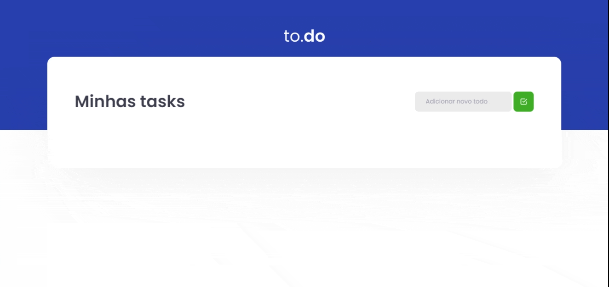

<p align="center">
   
</p>

<p align="center">
   <a href="https://www.linkedin.com/in/filipefmotta/">
      
   </a>

  <a aria-label="Last Commit" href="https://github.com/filipefdm/desafio01-trilha-reactjs/commits/master">
    
  </a>
</p>



# Temas

- [O que é o to.do?](#o-que-é-o-todo)
- [Tecnologias](#tecnologias)
- [Como executar?](#como-executar)

## O que é o to.do?

<b>to.do</b> é uma aplicação de atividades a fazer, onde é possível adicionar, remover, marcar e desmarcar uma tarefa como concluída e é 
o primeiro desafio do Ignite da Trilha de ReactJS criado pela [Rocketseat](https://rocketseat.com.br).
O objetivo dessa aplicação era treinar o conceito de manipulação de estado no React.

## Tecnologias

Foram utilizadas as seguintes tecnologias e ferramentas:

- [React](https://pt-br.reactjs.org)
- [Sass](https://sass-lang.com)
- [TypeScript](https://www.typescriptlang.org/)

## Como executar?

```bash
# Clone o repositório:
git clone https://github.com/filipefdm/desafio01-trilha-reactjs.git
# Acesse a pasta do projeto:
cd desafio01-trilha-reactjs
# Instalando as dependências do projeto:
yarn
# Rodando a aplicação:
yarn dev
```

Acesse <http://localhost:8080> no navegador para ver o resultado!

---

Feito com 💜 por [Filipe Motta](https://github.com/filipefdm) 😊
